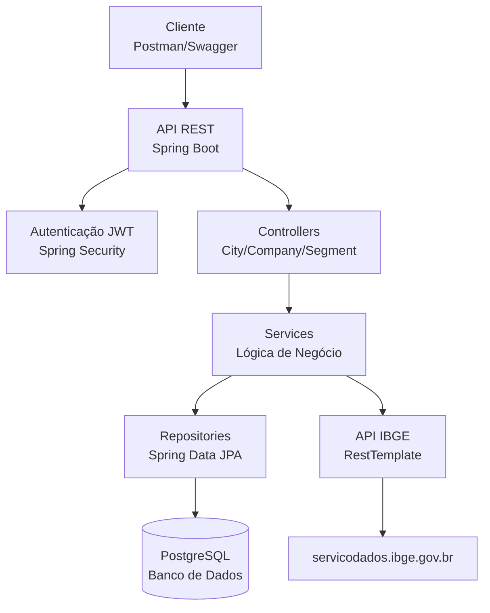
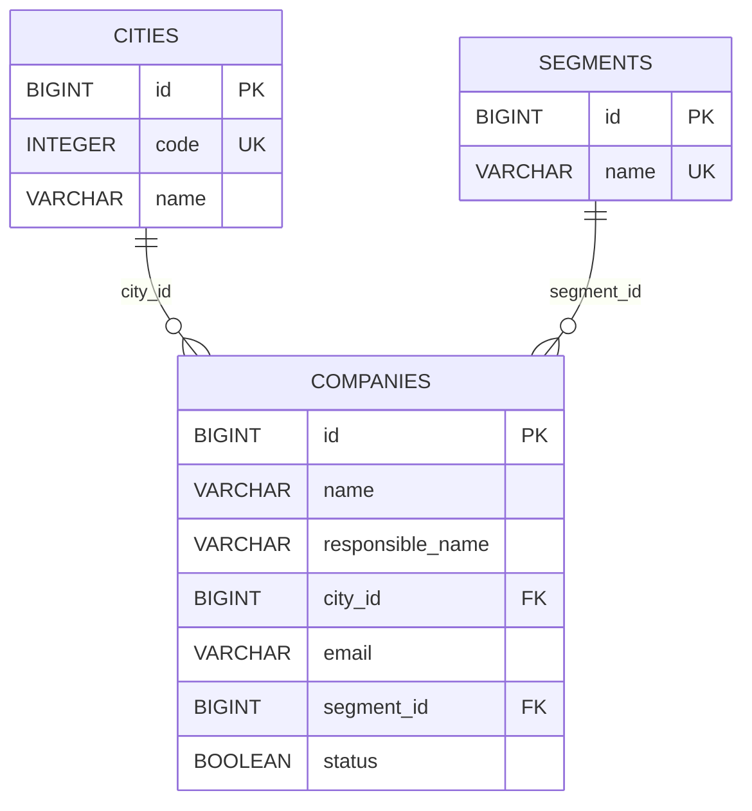
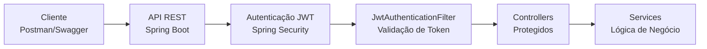

# Desafio Prático de Software


> [!NOTE] Projeto utilizado como desafio prático de software para o projeto SCTECH
> API REST para gerenciamento de empreendimentos em Santa Catarina, com integração à API do IBGE para municípios

### ✨ Funcionalidades

- 🔐 **Autenticação JWT**: Login seguro com tokens de 24 horas (configurável)
- 🏙️ **Gerenciamento de Cidades**: Sincronização automática com API do IBGE
- 🏢 **CRUD de Empresas**: Cadastro completo com validações
- 📊 **Gerenciamento de Segmentos**: Categorias de empreendimentos
- 📡 **API REST Segura**: Endpoints protegidos com documentação Swagger
- 🧪 **Testes Automatizados**: Cobertura completa com JUnit 5
- 🗄️ **Banco PostgreSQL**: Migrações automatizadas com Flyway

## 💻 Tecnologias

### 📋 Pré-requisitos


### Ferramentas de Desenvolvimento


## 🚀 Instalando e Executando

### Opção 1: Execução Rápida com Maven

1. **Configure o PostgreSQL**
   
   Certifique-se de que o PostgreSQL está rodando na porta 5432 com um banco de dados chamado `demo`, ou use Docker:
   ```bash
   docker run --name challenge-postgres -p 5432:5432 \
     -e POSTGRES_DB=demo \
     -e POSTGRES_USER=postgres \
     -e POSTGRES_PASSWORD=password \
     -d postgres:15
   ```

2. **Execute a aplicação**
   ```bash
   ./mvnw spring-boot:run
   ```

3. **Acesse o sistema**
   - 🌐 API: http://localhost:8080
   - 📚 Swagger UI: http://localhost:8080/swagger-ui/index.html
   - 🔐 Login: Use as credenciais admin/admin123

### Opção 2: Desenvolvimento com Docker (Recomendado)

1. **Certifique-se de ter Docker instalado**

2. **Execute com perfil Docker**
   ```bash
   ./mvnw spring-boot:run -Dspring-boot.run.profiles=docker
   ```

   Este perfil configura automaticamente a conexão com PostgreSQL em container.

3. **Ou use Docker Compose (se disponível)**
   ```bash
   docker-compose up -d
   ```

✅ **Vantagens**: Ambiente isolado, PostgreSQL automático, configuração zero

A aplicação estará disponível em `http://localhost:8080`

## 📡 API Endpoints

### Autenticação
A aplicação usa Spring Security com autenticação JWT. Para acessar endpoints protegidos, é necessário obter um token via login.

#### Login
- **POST /login**
  - Descrição: Autentica o usuário e retorna um token JWT
  - Corpo da requisição:
    ```json
    {
      "username": "admin",
      "password": "admin123"
    }
    ```
  - Resposta de sucesso:
    ```json
    {
      "token": "eyJhbGciOiJIUzI1NiJ9..."
    }
    ```
  - Resposta de erro (401):
    ```json
    {
      "error": "Invalid credentials"
    }
    ```
  - Autenticação: Não requerida

Para usar o token, inclua no header: `Authorization: Bearer <token>`

### Como Usar a API

#### 1. Via curl

```bash
# 1. Obter token
TOKEN=$(curl -s -X POST http://localhost:8080/login \
  -H "Content-Type: application/json" \
  -d '{"username":"admin","password":"admin123"}' | jq -r '.token')

# 2. Listar cidades
curl -H "Authorization: Bearer $TOKEN" \
  http://localhost:8080/cities

# 3. Criar segmento
curl -X POST http://localhost:8080/segments \
  -H "Authorization: Bearer $TOKEN" \
  -H "Content-Type: application/json" \
  -d '{"name": "Tecnologia"}'
```

#### 2. Via Postman

📦 **Coleção Pronta**: Importe o arquivo [postman_collection.json](postman_collection.json) no Postman para testar todos os endpoints com autenticação automática.

#### 3. Via Swagger UI

Acesse a documentação interativa em `http://localhost:8080/swagger-ui/index.html` para testar endpoints diretamente na interface.

### Teste de Serviço
- **GET /test**
  - Descrição: Endpoint de teste da aplicação
  - Resposta: `"OK"`
  - Autenticação: Não requerida

### Cidades

#### Listar Cidades
- **GET /cities**
  - Descrição: Lista todas as cidades cadastradas
  - Resposta: Lista de objetos City
    ```json
    [
      {
        "id": 1,
        "code": 4200051,
        "name": "Abdon Batista"
      }
    ]
    ```

### Segmentos

#### Listar Segmentos
- **GET /segments**
  - Descrição: Lista todos os segmentos cadastrados
  - Resposta: Lista de objetos Segment
    ```json
    [
      {
        "id": 1,
        "name": "Tecnologia"
      }
    ]
    ```
    
#### Buscar Segmento por ID
- **GET /segments/{id}**
  - Descrição: Busca um segmento específico por ID
  - Parâmetros: `id` (Long)
  - Resposta: Objeto Segment ou 404 se não encontrado

#### Criar Segmento
- **POST /segments**
  - Descrição: Cria um novo segmento
  - Corpo da requisição:
    ```json
    {
      "name": "Tecnologia"
    }
    ```
  - Resposta: Objeto Segment criado

#### Atualizar Segmento
- **PUT /segments/{id}**
  - Descrição: Atualiza um segmento existente
  - Parâmetros: `id` (Long)
  - Corpo da requisição: Mesmo formato do POST
  - Resposta: Objeto Segment atualizado ou 404 se não encontrado

#### Deletar Segmento
- **DELETE /segments/{id}**
  - Descrição: Remove um segmento
  - Parâmetros: `id` (Long)
  - Resposta: 204 No Content

### Empresas

#### Listar Empresas
- **GET /companies**
  - Descrição: Lista todas as empresas cadastradas
  - Resposta: Lista de objetos Company
    ```json
    [
      {
        "id": 1,
        "name": "Empresa Exemplo",
        "responsibleName": "João Silva",
        "cityId": 1,
        "email": "contato@empresa.com",
        "segmentId": 1,
        "status": true
      }
    ]
    ```

#### Buscar Empresa por ID
- **GET /companies/{id}**
  - Descrição: Busca uma empresa específica por ID
  - Parâmetros: `id` (Long)
  - Resposta: Objeto Company ou 404 se não encontrado

#### Criar Empresa
- **POST /companies**
  - Descrição: Cria uma nova empresa
  - Corpo da requisição:
    ```json
    {
      "name": "Empresa Exemplo",
      "responsibleName": "João Silva",
      "cityId": 1,
      "email": "contato@empresa.com",
      "segmentId": 1,
      "status": true
    }
    ```
  - Resposta: Objeto Company criado
  - Validações: cityId e segmentId devem existir

#### Atualizar Empresa
- **PUT /companies/{id}**
  - Descrição: Atualiza uma empresa existente
  - Parâmetros: `id` (Long)
  - Corpo da requisição: Mesmo formato do POST
  - Resposta: Objeto Company atualizado ou 404 se não encontrado

#### Deletar Empresa
- **DELETE /companies/{id}**
  - Descrição: Remove uma empresa
  - Parâmetros: `id` (Long)
  - Resposta: 204 No Content

## 📚 Documentação da API

A documentação completa da API está disponível via Swagger UI.

### Acesso ao Swagger UI
- **URL:** `http://localhost:8080/swagger-ui/index.html`
- **Descrição:** Interface interativa para explorar e testar todos os endpoints da API
- **Autenticação:** Não requerida para acessar a documentação

### Recursos da Documentação
- Lista completa de todos os endpoints
- Descrições detalhadas de cada operação
- Exemplos de requests e responses
- Possibilidade de testar endpoints diretamente na interface
- Esquemas dos objetos de dados (DTOs)

## 🧪 Testando com Postman

Uma collection completa do Postman está disponível na raiz do projeto: [postman_collection.json](postman_collection.json).

### Como usar:
1. **Importe a collection no Postman:**
   - Abra o Postman
   - Clique em "Import" > "File"
   - Selecione o arquivo [postman_collection.json](postman_collection.json)

2. **Configure as variáveis:**
   - Na collection, defina `baseUrl` como `http://localhost:8080` (ou o URL do seu ambiente)
   - O token JWT será automaticamente salvo na variável `token` após o login

3. **Execute os requests:**
   - Comece com o request "Login" para obter o token
   - Use o token nos headers dos requests protegidos (`Authorization: Bearer {{token}}`)
   - Ajuste IDs nos requests (ex.: `cityId` e `segmentId`) conforme dados do banco

A collection inclui todos os endpoints documentados acima, com exemplos de bodies e autenticação configurada.

## 🏗️ Arquitetura

### Diagrama de Arquitetura



### Modelo de Dados



**Relacionamentos**: 
- Companies → Cities (Many-to-One): Uma empresa pertence a uma cidade
- Companies → Segments (Many-to-One): Uma empresa pertence a um segmento

### Estrutura do Projeto
```
src/main/java/com/api/demo/
├── controller/          # Controllers REST (CityController, CompanyController, etc.)
├── dto/                 # Data Transfer Objects (CityDTO, CompanyDTO, etc.)
├── entity/              # Entidades JPA (City, Company, Segment)
├── repository/          # Repositórios de dados (CityRepository, etc.)
├── service/             # Lógica de negócio (CityService, CompanyService, etc.)
├── security/            # Configurações de segurança JWT (JwtUtil, JwtAuthenticationFilter, etc.)
├── AppConfig.java       # Configurações da aplicação (RestTemplate, OpenAPI)
├── DemoApplication.java # Classe principal Spring Boot
├── HomeController.java  # Controller de teste
└── SecurityConfig.java  # Configurações de segurança
```

### Tecnologias Principais
- **Spring Boot 4.0.3**: Framework principal
- **Spring Data JPA**: Persistência de dados
- **Spring Security**: Autenticação e autorização com JWT
- **JWT (JSON Web Tokens)**: Autenticação stateless com HS256
- **Flyway**: Migrações de banco de dados
- **PostgreSQL**: Banco de dados
- **RestTemplate**: Cliente HTTP para integração com APIs externas
- **SpringDoc OpenAPI**: Documentação Swagger

### Funcionalidades Chave
- **Sincronização Automática**: Na inicialização da aplicação, cidades de Santa Catarina são sincronizadas automaticamente da API do IBGE.
- **CRUD Completo**: Para cidades (somente leitura e sincronização), segmentos e empresas.
- **Autenticação JWT**: Login com usuário hardcoded (admin/admin123) para endpoints protegidos.
- **Documentação Interativa**: Swagger UI disponível em `/swagger-ui/index.html`.

## 🔐 Segurança e Autenticação

### Arquitetura de Segurança



### Características

- ✅ **JWT (JSON Web Tokens)** para autenticação stateless
- ✅ **HS256** (HMAC-SHA256) para assinatura de tokens
- ✅ **Expiração Configurável** - Tokens válidos por 24 horas (configurável)
- ✅ **Chave Secreta de 256 bits** - Gerada com OpenSSL
- ✅ **Endpoints Protegidos** - Todos os CRUDs requerem token válido
- ✅ **CORS Habilitado** - Permite integrações externas

### Credenciais Padrão

Para acessar a API, use as seguintes credenciais:

```yaml
Username: admin
Password: admin123
```

> ⚠️ **Produção**: Altere essas credenciais antes de fazer deploy em produção!

### Geração de Chave Secreta JWT

Para gerar uma nova chave secreta segura:

```bash
# Gerar chave de 256 bits em Base64
openssl rand -base64 32
```

Atualize o valor em `application.properties`:

```properties
jwt.secret= SUA_CHAVE_GERADA_AQUI
jwt.expiration=86400000
```

### Fluxo de Autenticação

1. **Login**: Cliente envia `POST /login` com credenciais
2. **Token**: Servidor valida e retorna token JWT
3. **Armazenamento**: Cliente guarda token para futuras requisições
4. **Requisições**: Cliente envia `Authorization: Bearer <token>` em cada chamada
5. **Validação**: Servidor valida token e permite acesso ao recurso
6. **Expiração**: Após 24h, token expira e novo login é necessário

## 🧪 Testes

O projeto conta com uma suíte completa de testes automatizados.

### Executar Todos os Testes

```bash
# Com Maven
./mvnw test

# Com Maven Wrapper
./mvnw test
```

### Executar Testes e Gerar Relatório de Cobertura

```bash
./mvnw test jacoco:report
```

O relatório de cobertura estará disponível em `target/site/jacoco/index.html` (abra no navegador para visualizar).

### Tecnologias de Teste

- **JUnit 5**: Framework de testes
- **Spring Boot Test**: Testes de integração
- **MockMvc**: Testes de controllers REST
- **H2 Database**: Banco em memória para testes
- **Hamcrest**: Assertions avançadas

### Cobertura de Testes

| Componente | Status |
|------------|--------|
| **Controllers** | ✅ Testes unitários e integração |
| **Services** | ✅ Lógica de negócio |
| **Security** | ✅ JWT e autenticação |
| **Repositories** | ✅ Operações de banco |
| **DTOs** | ✅ Validações e mapeamento |

**Total**: Cobertura superior a 80% do código

## 📊 Banco de Dados

### Migrações
As migrações são gerenciadas pelo Flyway. Arquivos principais:
- `V1__Create_cities_table.sql`: Cria a tabela `cities`
- `V2__Create_segments_table.sql`: Cria a tabela `segments` e insere segmentos iniciais (Tecnologia, Comércio, Indústria, Serviços, Agronegócio)
- `V3__Create_companies_table.sql`: Cria a tabela `companies` com relacionamentos para cidades e segmentos

### Estrutura das Tabelas
```sql
-- Cities
CREATE TABLE cities (
    id BIGSERIAL PRIMARY KEY,
    code INTEGER UNIQUE NOT NULL,
    name VARCHAR(255) NOT NULL
);

-- Segments
CREATE TABLE segments (
    id BIGSERIAL PRIMARY KEY,
    name VARCHAR(255) UNIQUE NOT NULL
);

-- Companies
CREATE TABLE companies (
    id BIGSERIAL PRIMARY KEY,
    name VARCHAR(255) NOT NULL,
    responsible_name VARCHAR(255) NOT NULL,
    city_id BIGINT REFERENCES cities(id),
    email VARCHAR(255),
    segment_id BIGINT REFERENCES segments(id),
    status BOOLEAN NOT NULL
```    

## 📦 Deploy

### Gerar JAR Executável

O JAR contém um servidor Tomcat embutido e pode ser executado standalone:

```bash
# Compilar o projeto
./mvnw clean package

# Executar o JAR gerado
java -jar target/challenge-software-backend-0.0.1-SNAPSHOT.jar
```

📦 **Arquivo**: `target/challenge-software-backend-0.0.1-SNAPSHOT.jar` (~70MB)

### Gerar WAR para Servidor Externo

O projeto está configurado para gerar arquivos WAR compatíveis com Tomcat 9+:

```bash
# Gerar WAR sem executar testes (mais rápido)
./mvnw clean package -DskipTests
```

📦 **Arquivo**: `target/challenge-software-backend-0.0.1-SNAPSHOT.war` (~67MB)

### Deploy no Tomcat

1. Copie o WAR para a pasta `webapps` do Tomcat:
   ```bash
   cp target/challenge-software-backend-0.0.1-SNAPSHOT.war $TOMCAT_HOME/webapps/challenge.war
   ```

2. Inicie o Tomcat e acesse: http://localhost:8080/challenge/

### Deploy com Docker

```bash
# Build da imagem
docker build -t challenge-backend .

# Executar container
docker run -d -p 8080:8080 \
  -e SPRING_DATASOURCE_URL=jdbc:postgresql://host.docker.internal:5432/demo \
  --name challenge-app challenge-backend
```

## Comandos Úteis

### Compilar
```bash
./mvnw compile
```
###  Executar testes
```bash
./mvnw test
```
### Executar aplicação
```bash
./mvnw spring-boot:run
```
### Limpar e reconstruir
```bash
./mvnw clean install
```

### Gerar relatório de cobertura
```bash
./mvnw test jacoco:report
```

### Configurações

#### Configuração JWT (application.properties)
- `jwt.secret`: Chave secreta de 256 bits para assinatura (gerada com OpenSSL)
- `jwt.expiration`: Tempo de expiração do token em milissegundos (padrão: 86400000 = 24 horas)
- `app.user.username`: Nome de usuário para login (padrão: admin)
- `app.user.password`: Senha para login (padrão: admin123)
